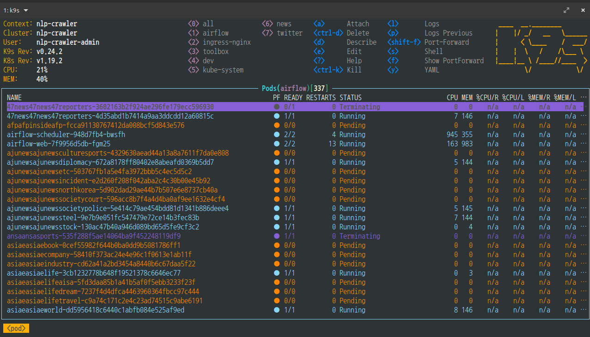
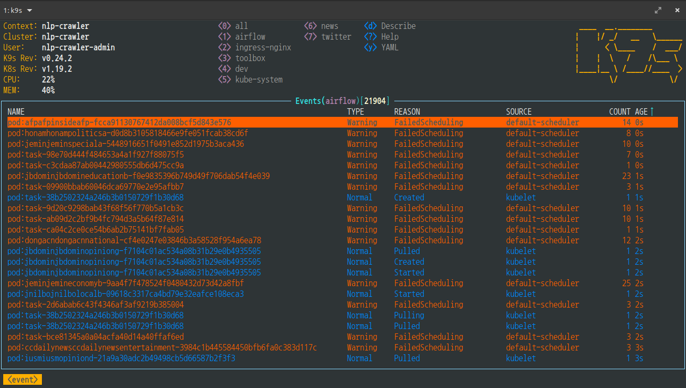
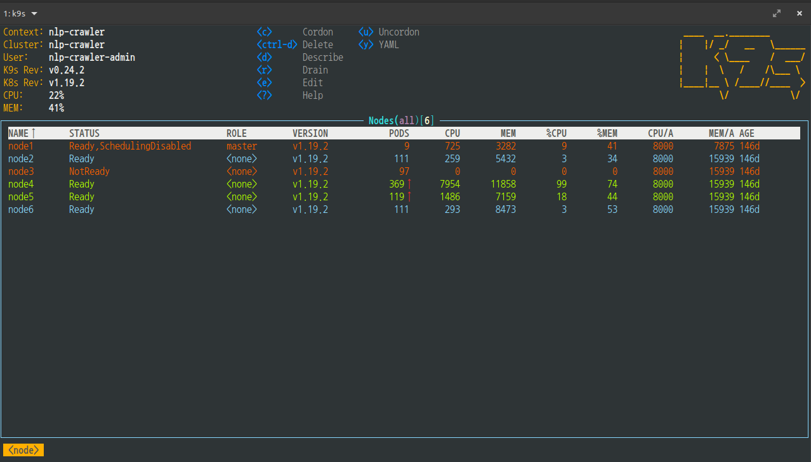
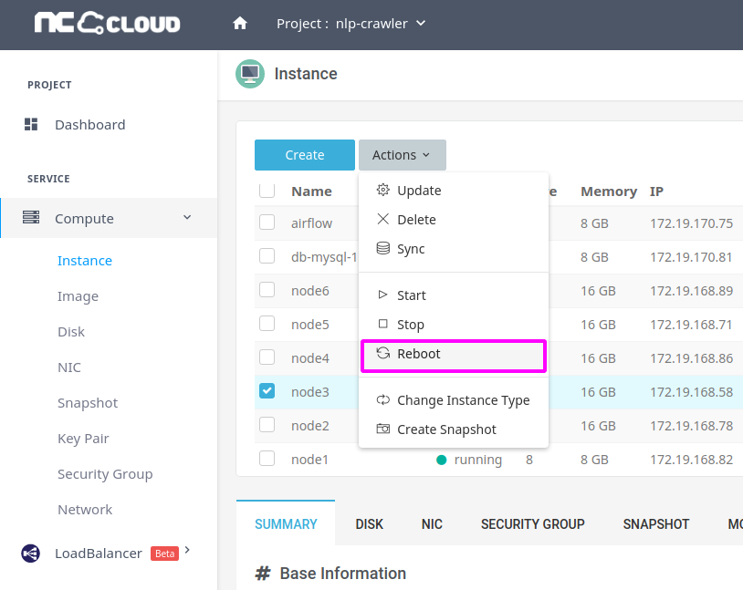

# 크롤러 운영 방식

* k8s + cronjob
  - naver
    naver-kin
    naver-reply
    nate
    daum
    bbs
* k8s + airflow
  - korea_news
    world_news

# config

* crawler config
* airflow dag

# repo.

* source: http://galadriel02.korea.ncsoft.corp/crawler/crawler.git@master
  -> docker image
* config: http://galadriel02.korea.ncsoft.corp/crawler/config.git@live
  -> docker image
* operation k8s + cronjob (helm): http://galadriel02.korea.ncsoft.corp/searchtf/sapphire-server/nlp-cloud/crawler.git@master
  -> x
* operation k8s + airflow (dag): http://galadriel02.korea.ncsoft.corp/crawler/airflow.git@master
* airflow install: http://galadriel02.korea.ncsoft.corp/crawler/airflow-helm.git@master


# docker registry

* NC CLOUD: nlp-utils -> nexus3


# crawler config merge

```bash
# branch check
git branch -r

git checkout live

git pull origin youngjune

git commit -am 'merge youngjune'

git push origin live
```

## issue

airflow 의 파드가 정상적으로 실행되지 않을때

> 파드 실행 상태 확인: panding 상태가 많은 경우 (k9s 에서 : pod airflow) 



> 이벤트 확인: FailedSchedule 상태가 많음 (: event)



> 노드 상태 확인 (: node)



> 만약, ssh 접속이 안될때: NC CLOUD 에서 해당 노드 재부팅



